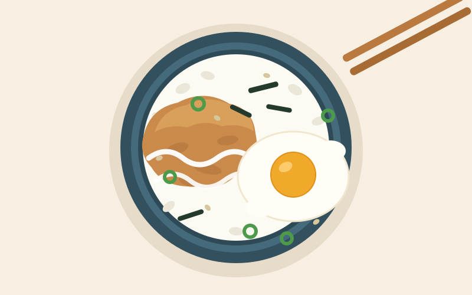

# 참치마요 덮밥

> 15분 · 1인분 · 팬 하나 · 우유 불필요

## 재료

- 밥 1공기
- 참치캔 1개 (작은 것, 100g)
- 마요네즈 2큰술
- 달걀 1개
- 간장 1큰술
- 설탕 1작은술
- 대파, 김가루, 깨 약간

## 만드는 법

1. **참치 손질 (3분)**
   참치는 기름을 꾹 짜서 뺀 뒤, 마요네즈 2큰술 + 간장 ½큰술과 섞어 둡니다.

2. **달걀프라이 (3분)**
   팬에 기름을 두르고 달걀을 반숙으로 부칩니다.

3. **소스 만들기 (2분)**
   같은 팬에 간장 ½큰술 + 설탕 1작은술 + 물 1큰술을 넣고 30초만 졸입니다.

4. **담기 (2분)**
   밥 → 참치마요 → 달걀 → 소스 → 김가루·대파·깨 순으로 올립니다.

## 팁

- 참치 기름을 제대로 빼야 밥이 질척해지지 않습니다.
- 매콤하게 먹고 싶다면 참치마요에 스리라차 1작은술을 섞으세요.
- 달걀 노른자를 터뜨려 비벼 먹으면 소스 역할을 대신합니다.

## 대체 재료

| 없는 재료 | 대체 |
|---|---|
| 참치캔 | 스팸, 닭가슴살 통조림, 게맛살 |
| 김가루 | 조미김을 손으로 부수기 |
| 대파 | 쪽파, 양파 다진 것 |
