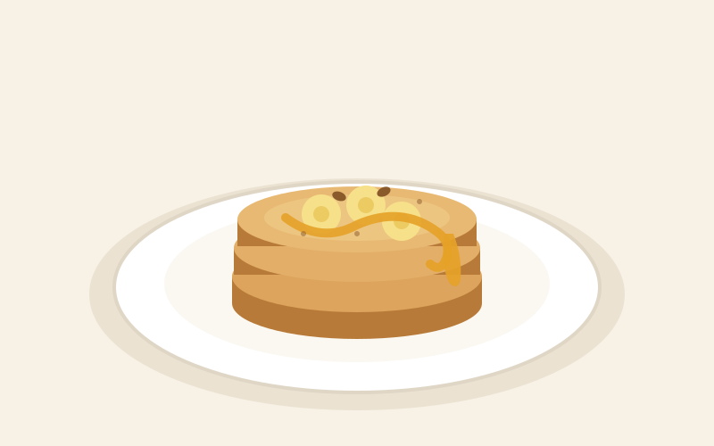

# 바나나팬케이크

> 10분 · 1인분 · 밀가루 없이 가능 · 설탕 없이 단맛

## 재료

- 잘 익은 바나나 1개 *(껍질에 갈색 점이 있는 것)*
- 달걀 1개
- 부침가루 또는 밀가루 3큰술 *(없으면 오트밀 가루)*
- 베이킹파우더 1/4작은술 *(선택)*
- 식용유 또는 버터 1작은술
- 꿀, 시나몬가루, 견과류

## 만드는 법

1. **반죽 (3분)**
   바나나를 그릇에 넣고 **포크로 완전히 으깹니다.** 덩어리가 남으면 뒤집을 때 부서집니다.
   달걀과 가루를 넣고 가볍게 섞습니다.

2. **팬 달구기 (4분)**
   팬에 기름을 얇게 바르고 **약불**로 달굽니다.

3. **굽기 (9분)**
   반죽을 숟가락으로 떠 동그랗게 올립니다.
   **윗면에 작은 기포가 터지면** 뒤집어 1분 더 굽습니다.

4. **마무리 (10분)**
   접시에 쌓고 꿀과 시나몬가루, 견과류를 올립니다.

## 응용

- 초코칩 한 줌을 반죽에 섞으면 디저트 느낌이 납니다.
- 땅콩버터를 얹으면 포만감이 올라가 아침 식사로 좋습니다.

## 밀가루 대체 재료

| 대체 재료 | 사용량 | 결과 |
|---|---|---|
| **부침가루** | 3큰술 | 가장 간단. 간이 살짝 있어 단짠 |
| 박력분 + 베이킹파우더 | 3큰술 + 1/4작은술 | 가장 폭신함 |
| 오트밀 가루 | 3큰술 | 쫀득하고 고소함 |
| 가루 없이 | 달걀 2개 | 부드러운 크레페 느낌. 뒤집기 어려워 작게 굽기 |

## 팁

- 바나나가 익을수록 달아 설탕이 필요 없습니다.
- 크게 부으면 속이 안 익으니 **지름 8cm 정도로 작게** 굽습니다.
- 센 불은 겉만 탑니다. 반드시 약불로 천천히.
